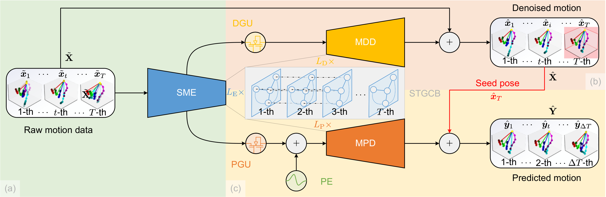

# Multi-Task Spatial-Temporal Graph Auto-Encoder for Hand Motion Denoising

This work (Multi-STGAE) extends [our conference paper](http://hubertshum.com/pbl_ismar2021hand.htm) presented at ISMAR 2021, which has been submitted to a journal. 

## Framework and Experiments

We recommend readers to watch the supplementary video of Multi-STGAE to gain a better understanding of the framework and to view the qualitative results.

Resources: [Multi-STGAE video](https://bhpan.buaa.edu.cn:443/link/8E94EF7ECE16BA78C7FC0237AB208475) | [STGAE website](http://hubertshum.com/pbl_ismar2021hand.htm) 



<center>
Framework overview of our proposed method Multi-STGAE: we utilize the prediction task to propose a multi-task framework for hand motion denoising. Through this framework, the denoised result is capable of preserving the temporal dynamics and the time delay problem can be greatly alleviated. In this way, it is possible to provide users with a satisfying experience during the interaction.
</center>

## Datasets

Download the dataset from [BUAA cloud disk](https://bhpan.buaa.edu.cn/link/5B608DC9CDF60E8DEC78E062B7A6B2A0) and save it in the `./data/dataset name` directory.

## Installation

To get started, you will need to first clone this project and then install the required dependencies.

### Basic packages

Install the required packages:

```bash
pip install -r requirements.txt
```

This will install all the required packages listed in the `requirements.txt` file.

### Visualization dependencies

We also provide a visualization tool for generating video files of the results. To use this tool, the following dependencies need to be installed:

- `LaTeX` tool

```bash
sudo apt-get install texlive-full
```

- `FFmpeg`

```bash
sudo apt-get install ffmpeg
```

- `pydot & graphviz`
```bash
sudo pip3 install pydot
sudo pip3 install graphviz
```

## Run and visualizing the results

To run the code, one can either use a configuration file or command parameters. If one wants to use the configuration file, please first configure it in `config/dataset name.ymal`.

### Training from scratch

To train from scratch, run the following command:

```bash
python main.py --phase train --dataset nyu --device 0 **args
```

One can see the meaning of parameters using the following command:

```bash
python main.py --help
```

### Testing with pre-trained weights

To test the code with pre-trained weights, run the following command:

```bash
python main.py --phase test 
```

### Visualizing the results

To visualize the results, use the following command:

```bash
python main.py --phase test --vis True
```

## Citation

If one finds our work useful, we kindly request that you cite our paper to acknowledge our efforts and contributions. Thanks!

```latex
@INPROCEEDINGS{stage2021,
  author={Zhou, Kanglei and Cheng, Zhiyuan and Shum, Hubert P. H. and Li, Frederick W. B. and Liang, Xiaohui},
  booktitle={2021 IEEE International Symposium on Mixed and Augmented Reality (ISMAR)}, 
  title={STGAE: Spatial-Temporal Graph Auto-Encoder for Hand Motion Denoising}, 
  year={2021},
  volume={},
  number={},
  pages={41-49},
  doi={10.1109/ISMAR52148.2021.00018}
}
```

## Contact

Feel free to contact me via `zhoukanglei[at]qq.com`.